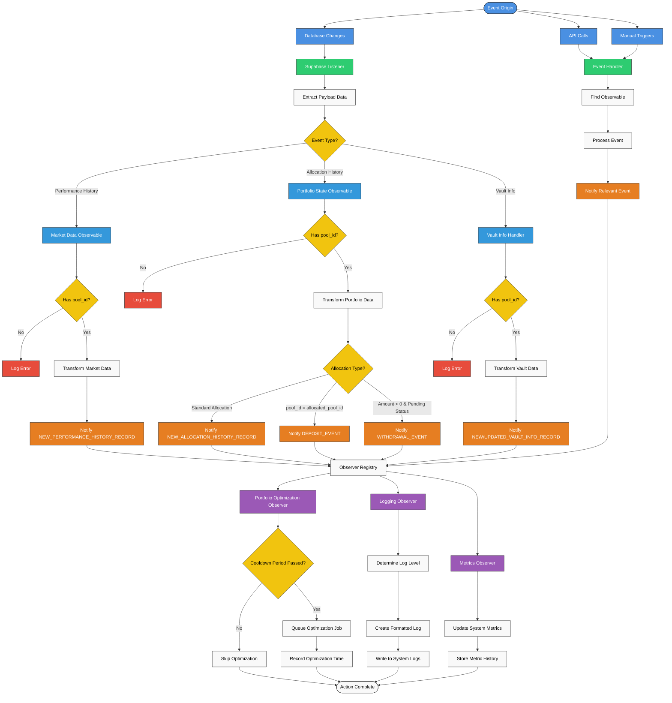

# Observer Component Flow

This document outlines the flow of events through the Observer component, explaining how events are detected, processed, and propagated throughout the system.

## Observer Flow Diagram



## Observer Pattern Implementation

The Observer component implements the Observer design pattern, which establishes a subscription mechanism to notify multiple objects (Observers) about events that happen to the object they're observing (Observable).

### Key Components

1. **Observables**: Objects that emit events

   - `MarketDataObservable` - Emits events related to market data changes
   - `PortfolioStateObservable` - Emits events related to portfolio state changes

2. **Observers**: Objects that listen for and react to events

   - `PortfolioOptimizationObserver` - Triggers portfolio optimizations in response to events
   - `LoggingObserver` - Records events in the system logs
   - `MetricsObserver` - Tracks system metrics based on events

3. **Event Types**: Defined constant event types

   - Market Events (e.g., `NEW_PERFORMANCE_HISTORY_RECORD`)
   - Portfolio Events (e.g., `NEW_ALLOCATION_HISTORY_RECORD`, `DEPOSIT_EVENT`, `WITHDRAWAL_EVENT`)
   - System Events (e.g., `SERVICE_STATUS_CHANGE`)
   - User Events (e.g., `NEW_VAULT_INFO_RECORD`)

4. **Event Handler**: Coordinates the setup and connection of observables and observers

5. **Supabase Listener**: Monitors database changes and converts them to events

## Event Flow Process

### 1. Event Origination

Events can originate from three primary sources:

1. **Database Changes**: Detected by Supabase Listener

   - New performance history records
   - New allocation history records
   - New or updated vault info records

2. **API Calls**: External systems calling APIs

   - Market data updates
   - Portfolio state updates
   - System status changes

3. **Manual Triggers**: Programmatic event generation
   - Triggered by scheduled tasks
   - Created by other system components

### 2. Event Detection and Transformation

#### 2.1 Supabase Listener Path

When a database change occurs:

1. **Extract Payload**: The Supabase listener extracts the payload data from the change notification
2. **Determine Event Type**: Based on the table and operation type (INSERT/UPDATE)
3. **Validate Data**: Check if the record contains required fields (pool_id)
4. **Transform Data**: Convert the raw record into the expected event data format
5. **Forward to Observable**: Send the data to the appropriate observable

#### 2.2 API/Manual Path

For API calls or manual triggers:

1. **Find Observable**: Locate the appropriate observable based on the event type
2. **Process Event**: Transform input data into the expected format
3. **Forward to Observable**: Send the data to the observable

### 3. Event Notification

When an observable receives event data:

1. **Validate Data**: Ensure the event data contains all required fields
2. **Log Event**: Create a debug log entry about the event
3. **Store State**: Update internal state if needed for future reference
4. **Notify Observers**: Call all registered observers for the specific event type

### 4. Observer Reactions

Different observers react to events in different ways:

#### 4.1 Portfolio Optimization Observer

1. **Check Cooldown**: Determine if enough time has passed since the last optimization
2. **Skip if Recent**: If an optimization was performed recently, skip
3. **Queue Job**: If optimization is needed, queue a job with the portfolio service
4. **Record Time**: Update the record of the last optimization time

#### 4.2 Logging Observer

1. **Determine Log Level**: Select appropriate log level based on event type
2. **Format Message**: Create a formatted log message with relevant details
3. **Write Log**: Write the formatted message to the system logs

#### 4.3 Metrics Observer

1. **Update Metrics**: Update internal metrics based on event data
2. **Store History**: Store historical metrics data for trend analysis
3. **Check Thresholds**: Check if any metrics exceed defined thresholds

## Special Event Types for Allocation History

The Allocation History records can trigger several different event types based on specific conditions:

### 1. DEPOSIT_EVENT

Emitted when a deposit is detected in the allocation history:

**Conditions**:

- `pool_id` equals `allocated_pool_id`
- Amount is positive (`amount > 0`)

This indicates funds are being added to the pool itself, rather than being allocated to another pool.

### 2. WITHDRAWAL_EVENT

Emitted when a withdrawal is detected in the allocation history:

**Conditions**:

- `pool_id` equals `allocated_pool_id`
- Amount is negative (`amount < 0`)
- Status is "pending" (`status = 'pending'`)

This indicates funds are being withdrawn from the pool.

### 3. NEW_ALLOCATION_HISTORY_RECORD

The standard event emitted for all new allocation history records, regardless of whether they also trigger other specific events.

## Observable Implementation

### MarketDataObservable

Monitors and processes market data changes:

```python
def process_performance_history_record(self, record):
    # Extract key data from the record
    pool_id = record.get('pool_id')
    timestamp = record.get('timestamp', datetime.now().isoformat())
    apy = record.get('APY', 0.0)
    tvl = record.get('tvl', 0.0)

    # Create and emit event
    event_data = {'pool_id': pool_id, 'apy': apy, 'tvl': tvl, 'timestamp': timestamp}
    self.notify(EventTypes.NEW_PERFORMANCE_HISTORY_RECORD, event_data)
```

### PortfolioStateObservable

Monitors and processes portfolio state changes:

```python
def process_allocation_history_record(self, record):
    # Extract key data from the record
    pool_id = record.get('pool_id')
    allocated_pool_id = record.get('allocated_pool_id')
    amount = record.get('amount', 0.0)
    status = record.get('status', '')
    current_allocation = record.get('current_allocation', {})
    target_allocation = record.get('target_allocation', {})
    timestamp = record.get('timestamp', datetime.now().isoformat())

    # Prepare base event data
    base_event_data = {
        'pool_id': pool_id,
        'timestamp': timestamp,
        'record_id': record.get('id'),
        'record': record
    }

    # Check for deposit
    if pool_id == allocated_pool_id and amount > 0:
        deposit_event = base_event_data.copy()
        deposit_event['amount'] = amount
        self.notify(EventTypes.DEPOSIT_EVENT, deposit_event)

    # Check for withdrawal
    elif amount < 0 and status.lower() == 'pending':
        withdrawal_event = base_event_data.copy()
        withdrawal_event['amount'] = abs(amount)
        withdrawal_event['status'] = status
        self.notify(EventTypes.WITHDRAWAL_EVENT, withdrawal_event)

    # Always notify of the new allocation history record
    allocation_event = base_event_data.copy()
    allocation_event['current_allocation'] = current_allocation
    allocation_event['target_allocation'] = target_allocation
    self.notify(EventTypes.NEW_ALLOCATION_HISTORY_RECORD, allocation_event)
```

## Observer Implementation

### PortfolioOptimizationObserver

Triggers portfolio optimization in response to significant events, including deposits and withdrawals:

```python
def handle_new_performance_history_record(self, event_data):
    pool_id = event_data['pool_id']

    # Check if cooldown period has passed
    if self._should_reoptimize(pool_id):
        # Queue optimization job
        self.portfolio_service.queue_optimization_job(
            portfolio_id=pool_id,
            trigger="new_performance_data",
            trigger_data=event_data
        )

        # Record optimization time
        self._record_optimization(pool_id)

def handle_deposit_event(self, event_data):
    pool_id = event_data['pool_id']
    amount = event_data['amount']

    self.logger.info(f"Deposit of {amount} detected for pool {pool_id}")

    # Deposits always trigger reoptimization, ignoring cooldown
    self.portfolio_service.queue_optimization_job(
        portfolio_id=pool_id,
        trigger="deposit",
        priority="high",  # Higher priority for deposit events
        trigger_data=event_data
    )

    # Record optimization time
    self._record_optimization(pool_id)

def handle_withdrawal_event(self, event_data):
    pool_id = event_data['pool_id']
    amount = event_data['amount']

    self.logger.info(f"Withdrawal of {amount} detected for pool {pool_id}")

    # Withdrawals always trigger reoptimization, ignoring cooldown
    self.portfolio_service.queue_optimization_job(
        portfolio_id=pool_id,
        trigger="withdrawal",
        priority="high",  # Higher priority for withdrawal events
        trigger_data=event_data
    )

    # Record optimization time
    self._record_optimization(pool_id)
```

### LoggingObserver

Records all system events:

```python
def handle_event(self, event_type, event_data):
    # Determine appropriate log level
    log_level = self._get_log_level_for_event(event_type)

    # Create formatted log message
    log_message = f"EVENT [{event_type}] for pool {event_data.get('pool_id', 'unknown')}"

    # Add event-specific details
    if event_type == EventTypes.DEPOSIT_EVENT:
        log_message += f" - Deposit amount: {event_data.get('amount', 0)}"
    elif event_type == EventTypes.WITHDRAWAL_EVENT:
        log_message += f" - Withdrawal amount: {event_data.get('amount', 0)}"

    # Log the event
    self.logger.log(log_level, log_message)
```

## Example Event Data Structures

### Performance History Event

```json
{
  "pool_id": 123,
  "apy": 0.053,
  "tvl": 1250000,
  "timestamp": "2023-06-15T10:30:45Z",
  "record_id": "PH78952",
  "record": {
    /* Full record data */
  }
}
```

### Allocation History Event

```json
{
  "pool_id": 123,
  "timestamp": "2023-06-15T10:30:45Z",
  "record_id": "AH78952",
  "current_allocation": {
    "AAPL": 0.18,
    "MSFT": 0.15,
    "AMZN": 0.22,
    "GOOGL": 0.25,
    "FB": 0.2
  },
  "target_allocation": {
    "AAPL": 0.15,
    "MSFT": 0.2,
    "AMZN": 0.18,
    "GOOGL": 0.22,
    "FB": 0.25
  },
  "needs_rebalancing": true,
  "record": {
    /* Full record data */
  }
}
```

### Deposit Event

```json
{
  "pool_id": 123,
  "timestamp": "2023-06-15T10:30:45Z",
  "record_id": "DE78952",
  "amount": 50000,
  "record": {
    "pool_id": 123,
    "allocated_pool_id": 123,
    "amount": 50000,
    "status": "completed"
    /* Additional record data */
  }
}
```

### Withdrawal Event

```json
{
  "pool_id": 123,
  "timestamp": "2023-06-15T10:30:45Z",
  "record_id": "WE78952",
  "amount": 25000,
  "status": "pending",
  "record": {
    "pool_id": 123,
    "allocated_pool_id": 456,
    "amount": -25000,
    "status": "pending"
    /* Additional record data */
  }
}
```

### Vault Info Event

```json
{
  "pool_id": 123,
  "timestamp": "2023-06-15T10:30:45Z",
  "strategy": "GROWTH",
  "risk_profile": "AGGRESSIVE",
  "constraints": {
    "max_allocation": 0.25,
    "min_assets": 5
  },
  "strategy_changed": true,
  "record": {
    /* Full record data */
  }
}
```

## Conclusion

The Observer component provides a powerful mechanism for real-time monitoring and reactive behavior in the ABS Finance system. By implementing a decoupled event-driven architecture, it enables efficient communication between components while maintaining separation of concerns and supporting scalable system evolution.

Key benefits of this architecture include:

1. **Decoupled Components**: System components can interact without direct dependencies
2. **Real-time Responsiveness**: Immediate reactions to important system events
3. **Extensibility**: New observers can be added without modifying existing code
4. **Maintainability**: Clear separation of concerns makes the system easier to maintain
5. **Scalability**: Components can be scaled independently based on event volume
