# Portfolio Optimization Flow

This document outlines the complete flow of data and processes involved in portfolio optimization, from initial data collection to final portfolio recommendations.

## Overview

The portfolio optimization process spans multiple components of the microservice architecture, starting with data collection in the ETL Server, through storage in Supabase, to processing and optimization in the Flask Server, and finally returning results to the user.

## Complete Flow Diagram

```
                          PORTFOLIO OPTIMIZATION FLOW
                          ==========================

+----------------+       +----------------+       +----------------+       +----------------+
|                |       |                |       |                |       |                |
| Market Data    |------>| ETL Server     |------>| Supabase       |------>| Flask Server   |
| Sources        |       | Data Collection|       | Data Storage   |       | Event Listeners|
|                |       |                |       |                |       |                |
+----------------+       +----------------+       +----------------+       +----------------+
                                                                                  |
                                                                                  |
                                                                                  v
+----------------+       +----------------+       +----------------+       +----------------+
|                |       |                |       |                |       |                |
| Return JSON    |<------| Generate       |<------| Apply          |<------| Market Data    |
| Response       |       | Portfolio      |       | Optimization   |       | Processing     |
|                |       | Results        |       | Models         |       |                |
+----------------+       +----------------+       +----------------+       +----------------+
```

## Detailed Process Steps

### 1. Data Collection (ETL Server)

**Components Involved:**

- ETL Server's Data Collection module
- Market Data Sources (Solana Network or other financial data providers)

**Process:**

1. ETL Server schedules regular data collection jobs
2. Connects to financial data sources via APIs
3. Retrieves market data (prices, volumes, etc.)
4. Performs initial validation of raw data
5. Prepares data for processing

**Code Paths:**

```
etl_server/src/collectors/market_data_collector.py
etl_server/src/collectors/solana_collector.py
```

### 2. Data Processing (ETL Server)

**Components Involved:**

- ETL Server's Data Processing module

**Process:**

1. Cleans raw market data (handling missing values, outliers)
2. Calculates derived metrics (returns, volatility, etc.)
3. Transforms data into the required format for storage
4. Validates processed data
5. Prepares data batches for storage

**Code Paths:**

```
etl_server/src/processors/data_cleaner.py
etl_server/src/processors/data_transformer.py
```

### 3. Data Storage (Supabase)

**Components Involved:**

- ETL Server's Storage Client
- Supabase Database

**Process:**

1. ETL Server connects to Supabase
2. Inserts or updates market data records
3. Triggers database event notifications
4. Data is stored in market_data table
5. Historical data is maintained for optimization and backtesting

**Code Paths:**

```
etl_server/src/storage/supabase_client.py
supabase/schema.sql (market_data table definition)
supabase/triggers/notify_market_data_update.sql
```

### 4. Event Detection (Flask Server)

**Components Involved:**

- Flask Server's Event Listeners
- Supabase Real-time Notifications

**Process:**

1. Event Listeners maintain a WebSocket connection to Supabase
2. Supabase sends notifications when new data is available
3. Event Listeners receive and validate notification events
4. Determine if data update requires portfolio recalculation
5. Initialize data retrieval process

**Code Paths:**

```
flask_server/src/events/listeners.py
flask_server/src/events/processors.py
```

### 5. Data Retrieval (Flask Server)

**Components Involved:**

- Flask Server's Storage module
- Supabase Database

**Process:**

1. Storage client connects to Supabase
2. Queries required market data
3. Retrieves relevant asset data and price history
4. Retrieves current portfolio state (if updating existing portfolio)
5. Prepares data for the optimization process

**Code Paths:**

```
flask_server/src/storage/supabase_client.py
flask_server/src/storage/market_data_repo.py
flask_server/src/storage/portfolio_repo.py
```

### 6. Data Preparation (Flask Server)

**Components Involved:**

- Flask Server's Portfolio Service
- Data Processing Utilities

**Process:**

1. Organizes asset data into time series
2. Calculates returns and covariance matrices
3. Prepares risk metrics
4. Validates and prepares constraints
5. Initializes optimization parameters

**Code Paths:**

```
flask_server/src/portfolio/models.py
flask_server/src/portfolio/services.py
flask_server/src/utils/date_utils.py
```

### 7. Portfolio Optimization (Flask Server)

**Components Involved:**

- Flask Server's Portfolio Service
- riskfolio-lib library

**Process:**

1. Initializes riskfolio-lib Portfolio object
2. Configures optimization parameters:
   - Risk measure (MV, MAD, CVaR, etc.)
   - Objective function (MinRisk, MaxRet, Sharpe, etc.)
   - Constraints (weight bounds, group constraints, etc.)
3. Calculates asset statistics (returns, covariance, etc.)
4. Executes the optimization algorithm
5. Retrieves optimal portfolio weights

**Code Paths:**

```
flask_server/src/portfolio/optimizer.py
flask_server/src/portfolio/risk_models.py
flask_server/src/portfolio/constraints.py
```

### 8. Results Processing (Flask Server)

**Components Involved:**

- Flask Server's Portfolio Service
- Data Processing Utilities

**Process:**

1. Validates optimization results
2. Calculates portfolio performance metrics:
   - Expected return
   - Expected risk/volatility
   - Sharpe ratio
   - Maximum drawdown (historical)
   - Other risk/performance metrics
3. Generates efficient frontier points (if requested)
4. Prepares result data structure

**Code Paths:**

```
flask_server/src/portfolio/services.py
flask_server/src/utils/helpers.py
```

### 9. Results Storage (Flask Server & Supabase)

**Components Involved:**

- Flask Server's Storage module
- Supabase Database

**Process:**

1. Formats portfolio results for storage
2. Connects to Supabase
3. Stores portfolio weights and metrics
4. Records optimization parameters and timestamp
5. Updates portfolio state if this was a recalculation

**Code Paths:**

```
flask_server/src/storage/portfolio_repo.py
flask_server/src/storage/supabase_client.py
```

### 10. Response Generation (Flask Server)

**Components Involved:**

- Flask Server's API Gateway
- Response Formatting Utilities

**Process:**

1. Retrieves portfolio results from the Portfolio Service
2. Formats results into a standardized JSON structure
3. Adds metadata (timestamp, version, etc.)
4. Prepares HTTP response
5. Returns response to the client

**Code Paths:**

```
flask_server/src/api/routes.py
flask_server/src/portfolio/services.py
```

## Portfolio Optimization Request Flow

When a client directly requests portfolio optimization (rather than triggered by data updates), the flow is similar but starts at the API Gateway:

1. Client sends POST request to `/api/portfolio/optimize` with parameters
2. API Gateway validates request and routes to Portfolio Service
3. Portfolio Service retrieves necessary data from Supabase
4. Optimization process executes as described above (steps 6-10)
5. Results are returned to the client as JSON

## Data Structures

### Input Data Structure

Market data in Supabase is structured as:

```json
{
  "asset_symbol": "AAPL",
  "timestamp": "2023-05-01T12:00:00Z",
  "price": 150.25,
  "volume": 15000000,
  "return": 0.015,
  "created_at": "2023-05-01T12:30:00Z"
}
```

### Optimization Request Structure

```json
{
  "assets": ["AAPL", "MSFT", "AMZN", "GOOGL", "FB"],
  "start_date": "2018-01-01",
  "end_date": "2023-01-01",
  "model": "Classic",
  "risk_measure": "MV",
  "objective": "Sharpe",
  "risk_free_rate": 0.0,
  "constraints": {
    "lower_bound": 0.0,
    "upper_bound": 0.3,
    "groups": {
      "Tech": ["AAPL", "MSFT", "GOOGL"],
      "Finance": ["JPM", "BAC"]
    },
    "group_constraints": {
      "Tech": { "min": 0.2, "max": 0.6 },
      "Finance": { "min": 0.1, "max": 0.4 }
    }
  }
}
```

### Optimization Result Structure

```json
{
  "portfolio_id": "12345abc",
  "timestamp": "2023-05-01T12:00:00Z",
  "weights": {
    "AAPL": 0.15,
    "MSFT": 0.2,
    "AMZN": 0.18,
    "GOOGL": 0.22,
    "FB": 0.25
  },
  "metrics": {
    "expected_return": 0.12,
    "volatility": 0.18,
    "sharpe_ratio": 0.67,
    "max_drawdown": 0.25
  },
  "efficient_frontier": [
    { "risk": 0.1, "return": 0.05 },
    { "risk": 0.15, "return": 0.09 },
    { "risk": 0.2, "return": 0.14 }
  ]
}
```

## Optimization Methods and Models

The Portfolio Service supports various optimization approaches:

1. **Classic Mean-Variance Optimization**

   - Based on Harry Markowitz's Modern Portfolio Theory
   - Minimizes portfolio variance for a given level of expected return

2. **Black-Litterman Model**

   - Incorporates investor views into the optimization process
   - Helps address estimation error issues in mean-variance optimization

3. **Risk Parity**

   - Allocates assets based on risk contribution rather than capital allocation
   - Aims for equal risk contribution from each asset

4. **Hierarchical Risk Parity**

   - Uses hierarchical clustering to improve portfolio diversification
   - Less sensitive to estimation errors

5. **Conditional Value at Risk (CVaR) Optimization**
   - Focuses on tail risk minimization
   - More resistant to outliers than traditional mean-variance approaches

## Error Handling

Throughout the portfolio optimization flow, errors are handled at multiple levels:

1. **Data Validation Errors**

   - Invalid or missing market data
   - Insufficient historical data
   - Invalid asset symbols

2. **Optimization Errors**

   - Infeasible constraints
   - Convergence issues
   - Numerical stability problems

3. **System Errors**
   - Database connection issues
   - Service unavailability
   - Resource constraints

Each error type includes appropriate logging, notification, and client response, with detailed error messages to assist troubleshooting.

## Performance Considerations

The portfolio optimization process includes several performance optimizations:

1. **Data Caching**

   - Frequently used market data is cached
   - Covariance matrices are cached when possible

2. **Parallel Processing**

   - Multiple optimization runs can execute in parallel
   - Efficient frontier calculations are parallelized

3. **Resource Management**

   - Long-running optimizations are monitored
   - Resource limits are enforced to prevent overload

4. **Result Caching**
   - Recent optimization results are cached
   - Identical optimization requests return cached results

These optimizations ensure responsive performance even with large portfolios and extensive historical data.

# Portfolio Reallocation Process Flow

This document outlines the flow for reallocating a portfolio when the target portfolio differs from the current allocation.

## Process Flow Diagram

```mermaid
flowchart TD
    Start([Start]) --> Current[Fetch Current Portfolio]
    Start --> Target[Fetch Target Portfolio]

    Current & Target --> Compare{Compare Portfolios}

    %% Check if reallocation is needed
    Compare --> CheckDiff{Difference > Threshold?}

    %% No reallocation needed path
    CheckDiff -->|No| NoRealloc[No Reallocation Needed]
    NoRealloc --> End1([End])

    %% Reallocation path
    CheckDiff -->|Yes| FetchMarket[Fetch Market Data]
    FetchMarket --> FetchConstraints[Fetch Constraints]

    FetchConstraints --> CalcRealloc[Calculate Reallocation Plan]

    CalcRealloc --> MinimizeTx[Minimize Transactions]
    MinimizeTx --> CheckTaxLot{Consider Tax Lots?}

    %% Tax-efficient path
    CheckTaxLot -->|Yes| TaxHarvest[Optimize for Tax Efficiency]
    TaxHarvest --> GenPlan

    %% Standard path
    CheckTaxLot -->|No| GenPlan[Generate Reallocation Plan]

    GenPlan --> SimulateImpact[Simulate Market Impact]

    SimulateImpact --> CheckFeasible{Plan Feasible?}

    %% Infeasible plan path
    CheckFeasible -->|No| Relax[Relax Constraints]
    Relax --> CalcRealloc

    %% Execute plan path
    CheckFeasible -->|Yes| GenTx[Generate Transaction List]

    GenTx --> CostAnalysis[Transaction Cost Analysis]

    CostAnalysis --> CheckCost{Costs Acceptable?}

    %% High cost path
    CheckCost -->|No| AdjustPlan[Adjust Plan]
    AdjustPlan --> MinimizeTx

    %% Approved plan path
    CheckCost -->|Yes| DisplaySummary[Display Reallocation Summary]

    DisplaySummary --> ConfirmUser{User Confirms?}

    %% Rejected by user
    ConfirmUser -->|No| End2([End])

    %% Execute transactions
    ConfirmUser -->|Yes| ExecuteTx[Execute Transactions]

    ExecuteTx --> VerifyResults[Verify Results]

    VerifyResults --> UpdateRecords[Update Portfolio Records]

    UpdateRecords --> End3([End])

    %% Styling
    classDef default fill:#f9f9f9,stroke:#333,color:black
    classDef input fill:#4a90e2,stroke:#333,color:white
    classDef process fill:#2ecc71,stroke:#333,color:white
    classDef market fill:#3498db,stroke:#333,color:white
    classDef check fill:#f1c40f,stroke:#333,color:black
    classDef execute fill:#e67e22,stroke:#333,color:white
    classDef analysis fill:#9b59b6,stroke:#333,color:white

    class Start,End1,End2,End3 input
    class Current,Target,FetchMarket,FetchConstraints market
    class Compare,CheckDiff,CheckTaxLot,CheckFeasible,CheckCost,ConfirmUser check
    class CalcRealloc,MinimizeTx,TaxHarvest,GenPlan,Relax,AdjustPlan process
    class SimulateImpact,CostAnalysis analysis
    class GenTx,ExecuteTx,VerifyResults,UpdateRecords execute
```



## Process Description

1. **Portfolio Comparison**

   - Fetch current portfolio holdings and weights
   - Fetch target portfolio allocation from optimization results
   - Compare the difference between current and target portfolios

2. **Reallocation Decision**

   - If the difference is below a specified threshold, no reallocation is needed
   - If significant differences exist, proceed with reallocation planning

3. **Market Data and Constraints**

   - Fetch current market data (prices, volumes, bid-ask spreads)
   - Retrieve applicable constraints (min/max positions, turnover limits, etc.)

4. **Reallocation Planning**

   - Calculate required trades to move from current to target allocation
   - Minimize the number and size of transactions
   - Consider tax implications if relevant (tax-loss harvesting, short vs. long-term gains)

5. **Market Impact Simulation**

   - Simulate the market impact of planned trades
   - Assess feasibility of the plan given liquidity constraints
   - Relax constraints if necessary and recalculate

6. **Transaction Generation**

   - Generate a detailed list of buy/sell transactions
   - Analyze transaction costs (commissions, spreads, market impact)
   - Adjust plan if costs are too high

7. **Execution**
   - Display reallocation summary for user confirmation
   - Execute transactions upon approval
   - Verify execution results match expected outcomes
   - Update portfolio records with new allocations

## Key Considerations

- **Transaction Costs**: Minimize costs by considering commissions, bid-ask spreads, and market impact
- **Tax Efficiency**: Consider tax implications when selecting which lots to sell
- **Turnover Control**: Avoid excessive trading by setting minimum trade size thresholds
- **Liquidity**: Ensure trades are feasible given available market liquidity
- **Risk Continuity**: Maintain appropriate risk exposure during transition

## Implementation References

The reallocation process leverages the following components:

- Portfolio Optimizer for target allocation generation
- Risk Models for assessing transition risk
- Market Data Service for current prices and liquidity information
- Transaction Cost Models for estimating execution costs
