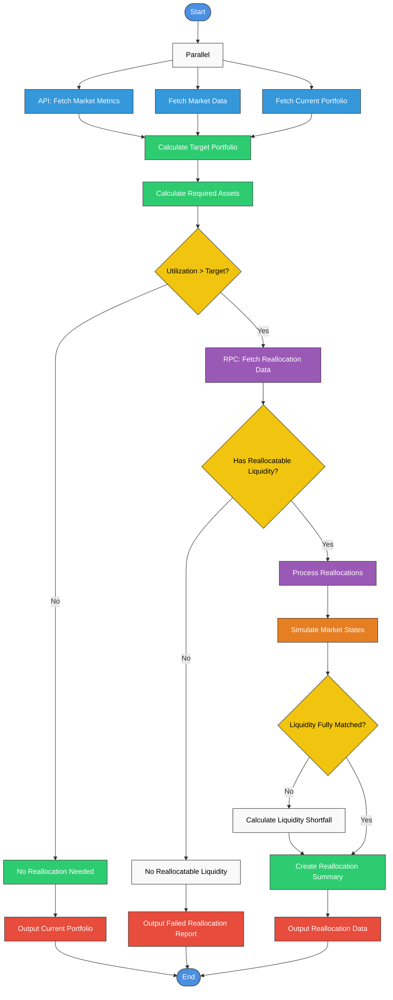

# Portfolio Reallocation Flow

This document outlines the flow for portfolio reallocation, starting from market data collection through calculating the target portfolio and processing reallocation if needed.

## Reallocation Process Flowchart



## Understanding Asset Utilization

In the context of portfolio reallocation, "utilization" refers to how efficiently capital is deployed across assets relative to target allocations. This concept is crucial for several reasons:

### Definition of Utilization

- **Asset Utilization**: The percentage of an asset's target allocation that is currently deployed or invested
- **Portfolio Utilization**: The weighted average utilization across all assets in the portfolio
- **Target Utilization**: The optimal level of capital deployment based on market conditions and investment strategy

### How Utilization Is Calculated

Utilization is typically calculated as:

```
Asset Utilization = Current Asset Value / Target Asset Value
```

For example:

- If the target allocation for AAPL is $200,000 but only $180,000 is currently invested, the utilization is 90%
- If another asset has a target of $100,000 but $120,000 is invested, its utilization is 120%

### Utilization Thresholds

The system uses several utilization thresholds:

- **Under-utilization**: Values below 100% indicate uninvested capital or underweight positions
- **Target Range**: Typically 95-105%, considered optimal and requiring no action
- **Over-utilization**: Values above target (e.g., >105%) indicate overweight positions that may need rebalancing

### Why Utilization Matters in Reallocation

When utilization exceeds target levels (the `CheckUtil` decision point in the flowchart), special handling is required:

1. **High Utilization Scenarios**:

   - Assets have appreciated significantly, leading to overweight positions
   - Margin or leverage is being used beyond target levels
   - Cash reserves are below strategic minimums

2. **Reallocation Implications**:

   - May require selling overweight assets to rebalance
   - Might necessitate additional liquidity sources
   - Could trigger tax consequences from realizing gains

3. **RPC: Reallocation Process Control**:
   - When utilization exceeds targets, the system calls the RPC service
   - RPC provides advanced reallocation strategies and liquidity sources
   - Helps determine if additional assets can be made available for reallocation

### Example Utilization Analysis

```json
{
  "portfolio_utilization": {
    "overall": 1.08, // 108% of target capital is deployed
    "by_asset_class": {
      "equities": 1.15, // 15% overweight in equities
      "fixed_income": 0.92, // 8% underweight in bonds
      "alternatives": 1.03, // 3% overweight in alternatives
      "cash": 0.65 // 35% below target cash reserves
    },
    "by_individual_asset": [
      { "asset": "AAPL", "utilization": 1.22 }, // 22% overweight
      { "asset": "MSFT", "utilization": 1.18 }, // 18% overweight
      { "asset": "TLT", "utilization": 0.88 }, // 12% underweight
      { "asset": "CASH", "utilization": 0.65 } // 35% below target
    ]
  }
}
```

## Process Description

The portfolio reallocation process follows these steps:

1. **Initial Data Collection (Parallel)**

   - **API: Fetch Market Metrics**: Retrieve current market indicators, economic metrics, and risk factors
   - **Fetch Market Data**: Obtain current pricing, volume, and liquidity data for relevant assets
   - **Fetch Current Portfolio**: Get the current portfolio composition, including holdings and weights

2. **Target Portfolio Calculation**

   - Calculate optimal target portfolio allocation using:
     - Market metrics and economic indicators
     - Current market pricing and volatility
     - Current portfolio composition
     - Investment objectives and constraints

3. **Required Assets Calculation**

   - Calculate the required assets needed to achieve the target portfolio
   - Determine specific asset quantities and allocations needed
   - Assess current vs. required asset levels

4. **Utilization Assessment**

   - Check if asset utilization exceeds target levels
   - If utilization is within acceptable range, no reallocation is needed
   - If utilization exceeds targets, proceed with reallocation planning
   - For high utilization scenarios, fetch additional reallocation data via RPC

5. **Liquidity Assessment and Simulation**

   - Verify sufficient liquidity for reallocation
   - Simulate market impact of planned transactions
   - Check if liquidity fully matches reallocation needs
   - If fully matched, proceed directly to creating reallocation summary
   - If partially matched, calculate shortfall before creating summary

6. **Summary Creation and Data Output**
   - Create comprehensive reallocation summary
   - Output detailed reallocation data:
     - Current and target portfolio allocations
     - Utilization metrics before and after reallocation
     - Expected risk/return metrics
     - Liquidity assessment results

## Output Data Structure

When liquidity is fully matched, the system outputs a reallocation data structure without transaction details:

```json
{
  "reallocation_id": "RA78952",
  "timestamp": "2023-06-15T10:30:45Z",
  "status": "MATCHED",
  "current_portfolio": {
    "total_value": 1250000,
    "holdings": [
      { "asset": "AAPL", "weight": 0.18, "value": 225000 },
      { "asset": "MSFT", "weight": 0.15, "value": 187500 },
      { "asset": "AMZN", "weight": 0.22, "value": 275000 },
      { "asset": "GOOGL", "weight": 0.25, "value": 312500 },
      { "asset": "FB", "weight": 0.2, "value": 250000 }
    ]
  },
  "target_portfolio": {
    "total_value": 1250000,
    "holdings": [
      { "asset": "AAPL", "weight": 0.15, "value": 187500 },
      { "asset": "MSFT", "weight": 0.2, "value": 250000 },
      { "asset": "AMZN", "weight": 0.18, "value": 225000 },
      { "asset": "GOOGL", "weight": 0.22, "value": 275000 },
      { "asset": "FB", "weight": 0.25, "value": 312500 }
    ]
  },
  "utilization_metrics": {
    "pre_reallocation": {
      "overall": 1.08,
      "by_asset": [
        { "asset": "AAPL", "utilization": 1.2 },
        { "asset": "MSFT", "utilization": 0.75 },
        { "asset": "AMZN", "utilization": 1.22 },
        { "asset": "GOOGL", "utilization": 1.14 },
        { "asset": "FB", "utilization": 0.8 }
      ]
    },
    "post_reallocation": {
      "overall": 1.0,
      "by_asset": [
        { "asset": "AAPL", "utilization": 1.0 },
        { "asset": "MSFT", "utilization": 1.0 },
        { "asset": "AMZN", "utilization": 1.0 },
        { "asset": "GOOGL", "utilization": 1.0 },
        { "asset": "FB", "utilization": 1.0 }
      ]
    }
  },
  "liquidity_metrics": {
    "fully_matched": true,
    "estimated_market_impact": 0.0012,
    "total_reallocation_amount": 250000
  },
  "risk_metrics": {
    "current_volatility": 0.15,
    "target_volatility": 0.14,
    "current_sharpe": 0.65,
    "target_sharpe": 0.72,
    "expected_tracking_error": 0.02
  },
  "reallocation_summary": {
    "total_assets_adjusted": 5,
    "direction_changes": [
      { "asset": "AAPL", "direction": "DECREASE" },
      { "asset": "MSFT", "direction": "INCREASE" },
      { "asset": "AMZN", "direction": "DECREASE" },
      { "asset": "GOOGL", "direction": "DECREASE" },
      { "asset": "FB", "direction": "INCREASE" }
    ],
    "largest_adjustments": [
      { "asset": "MSFT", "percent_change": 33.3 },
      { "asset": "FB", "percent_change": 25.0 }
    ]
  }
}
```

## Implementation Considerations

- **Optimization Criteria**: Balance between minimizing transaction costs and tracking error to target
- **Slippage Models**: Use asset-specific slippage models based on historical trade data
- **Tax-Awareness**: Consider tax lots to minimize tax impact when selecting which shares to sell
- **Circuit Breakers**: Implement protections against excessive trading during volatile markets
- **Partial Reallocation**: Allow for staged reallocation when full rebalancing isn't possible due to liquidity constraints
- **Utilization Management**: Monitor and manage utilization levels to ensure efficient capital deployment
